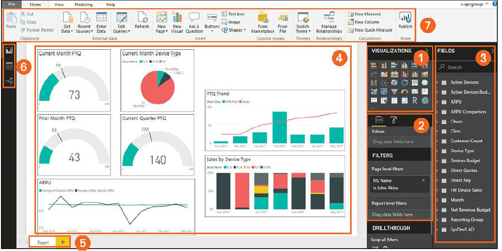

# Power BI Desktop

## GROUP 1
Visualizations pane This pane allows easy access to several
visualizations, including bar charts, line charts, pie charts, statistical
graphs, and more to represent your data in reports.  

## GROUP 2
Formatting pane This pane enables you to apply filters to your data to
alter the selected visualization, including report-level filters, page-level
filters, and drill-through filters. This pane also offers access to tools to
change the appearance of reports such as colors, borders, size, and more.

## GROUP 3
Fields pane This pane includes the active datasets available for
generating reports. To add a dataset to your report, simply select its
checkbox in the Fields pane. 

## GROUP 4
Report pane This pane displays visualizations selected by the user from
various reports. 

## GROUP 5
Pages Some Power BI reports contain multiple pages. To add a page,
you click the plus button at the bottom of the screen. You can also use
these controls to display a different page.

## GROUP 6
Display tabs You can click the Report, Data, and Relationship tabs.
Report view, Data view, and Relationship view.

## GROUP 7
Menu bar The menu bar allows access to menus for editing templates,
opening new files, changing page settings, managing report modeling,
accessing help, and more.

