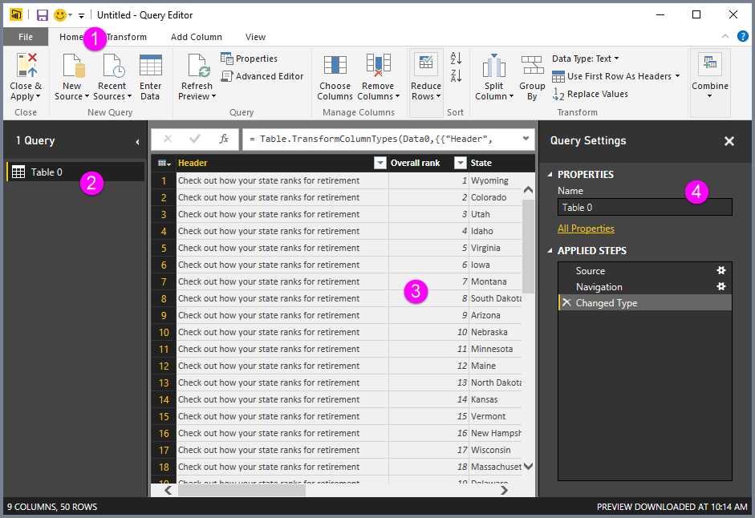
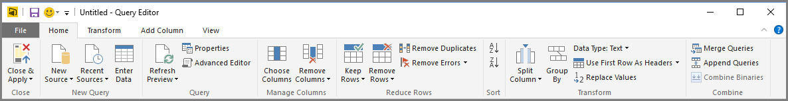
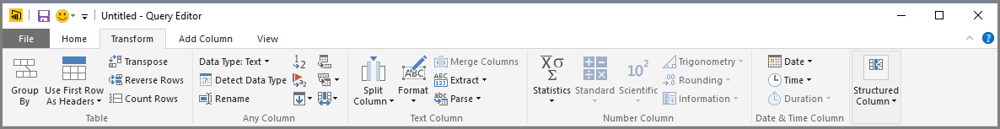
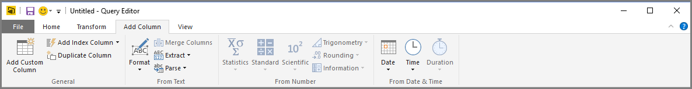
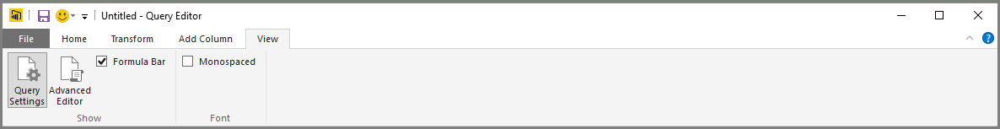
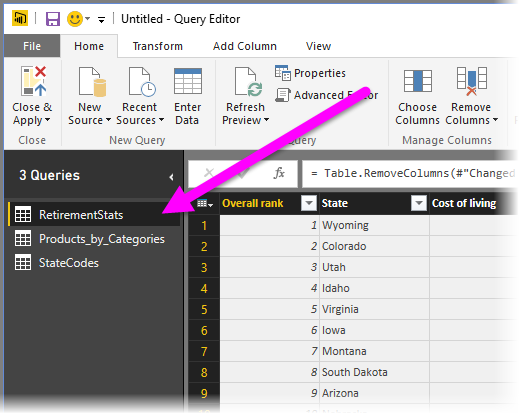
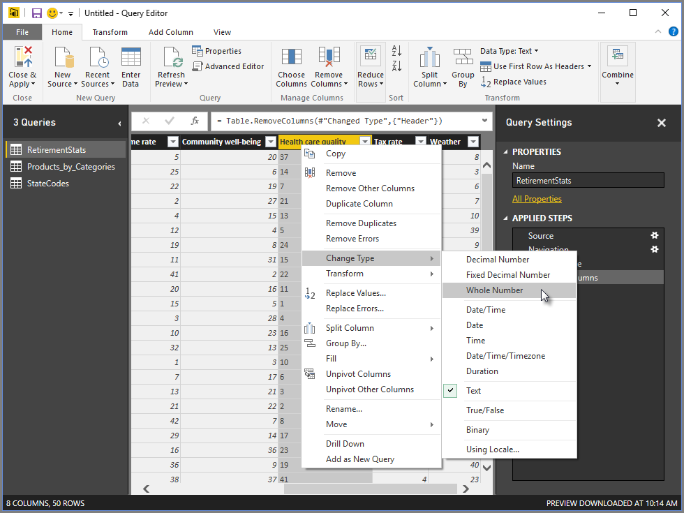
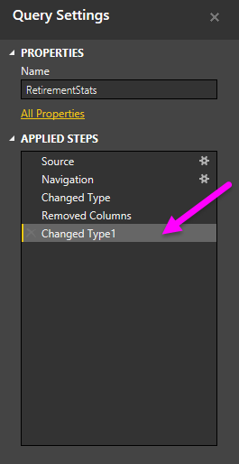
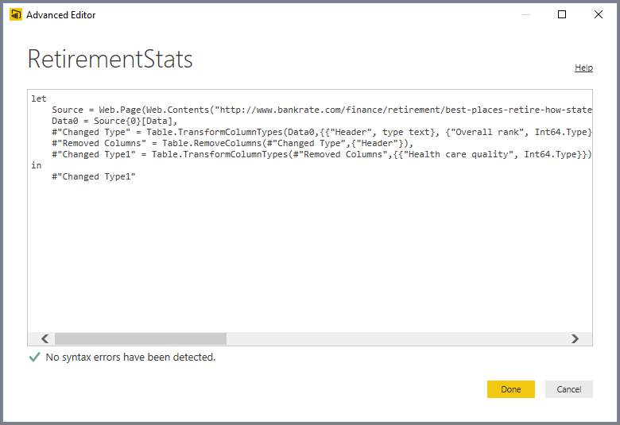
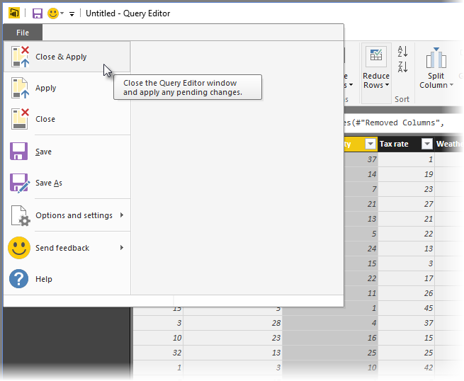

# The Query Editor

## Query Editor appears once a data connection is established:
1. In the ribbon, many buttons are now active to interact with the data in the query
2. In the left pane, queries are listed and available for selection, viewing, and shaping
3. In the center pane, data from the selected query is displayed and available for shaping
4. The Query Settings window appears, listing the query’s properties and applied steps

## The query ribbon
The Home tab contains the common query tasks, including the first step in any query, which is Get Data.  
  
The Transform tab provides access to common data transformation tasks, such as adding or removing columns, changing data types, splitting columns, and other data-driven tasks.  
  
The Add Column tab provides additional tasks associated with adding a column, formatting column data, and adding custom columns.  
  
The View tab on the ribbon is used to toggle whether certain panes or windows are displayed. It’s also used to display the Advanced Editor.  

## The left pane
The left pane displays the number of active queries, as well as the name of the query. When you select a query from the left pane, its data is displayed in the center pane, where you can shape and transform the data to meet your needs.  

## The center (data) pane
In the center pane, or Data pane, data from the selected query is displayed. This is where much of the work of the Query view is accomplished.  
Notice that many of these right-click menu items are the same as buttons in the ribbon tabs.  

## The query settings pane
The Query Settings pane is where all steps associated with a query are displayed. For example, in the following image, the Applied Steps section of the Query Settings pane reflects the fact that we just changed the type of the Overall score column.  
  
As additional shaping steps are applied to the query, they are captured in the Applied Steps section.  

It’s important to know that the underlying data is not changed; rather, Query Editor adjusts and shapes its view of the data, and any interaction with the underlying data occurs based on Query Editor’s shaped and modified view of that data.  
## The Advanced Editor
If you want to see the code that Query Editor is creating with each step, or want to create your own shaping code, you can use the Advanced Editor. To launch the advanced editor, select View from the ribbon, then select Advanced Editor. A window appears, showing the existing query code.  

## Saving your work
When your query is where you want it, you can have Query Editor apply the changes to the data model into Power BI Desktop, and close Query Editor. To do that, select Close & Apply from Query Editor's File menu.  
  
As progress is made, Power BI Desktop provides a dialog to display its status.  
Once you have your query where you want it, or if you just want to make sure your work is saved, Power BI Desktop can save your work in the form of a .pbix file.  