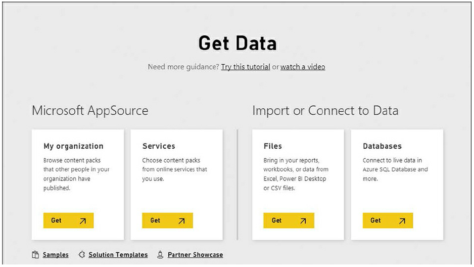
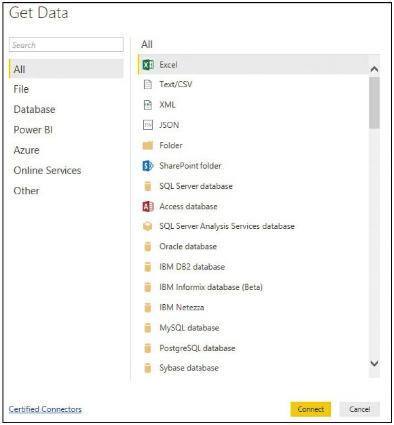
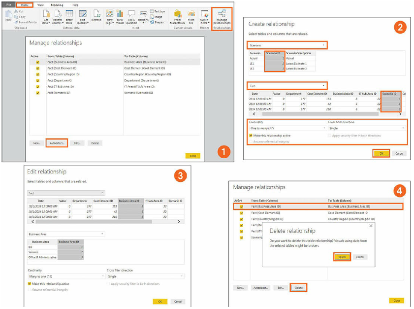
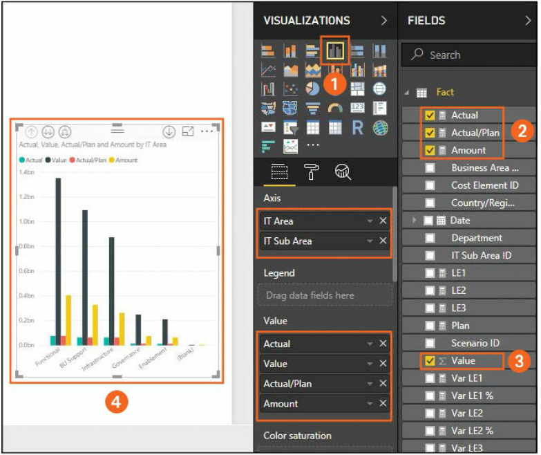
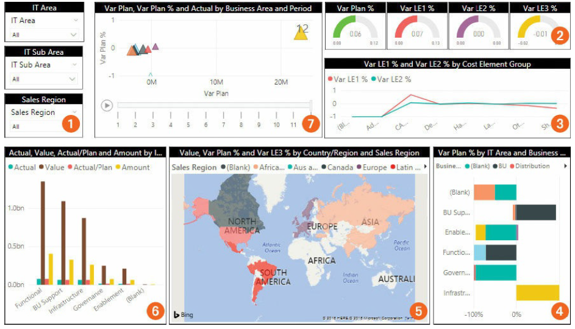
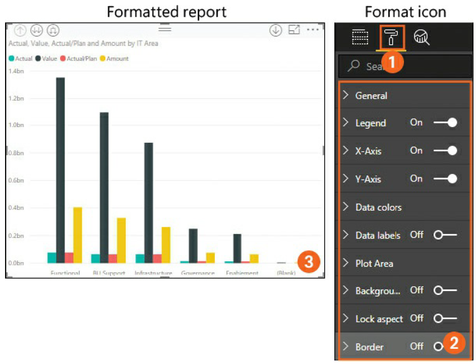
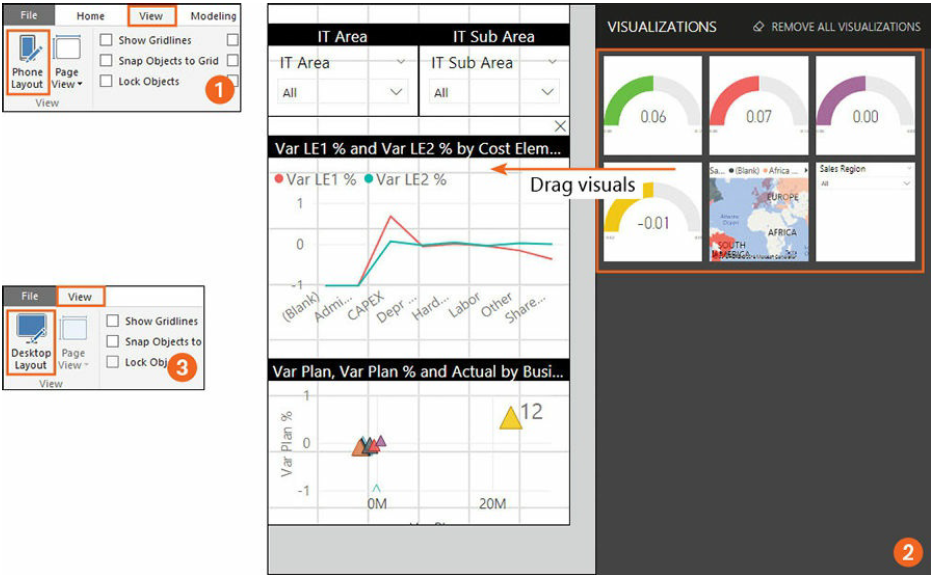
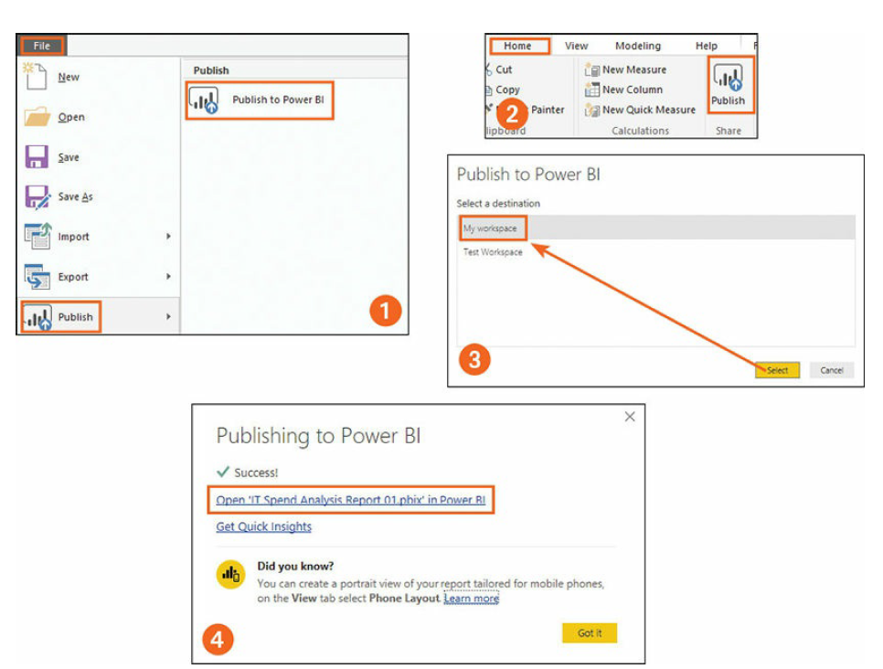

# Power BI report development

## Data sources supported by Power BI

### Data sources in Power BI Desktop
- File
- Database
- Power BI
- Azure
- Online Services
- Other
### Data sources in Power BI service
- Microsoft AppSource This category contains content packs created and
shared by other users within your organization. It also contains online
services—in other words, third-party services that offer content packs.
(Content packs are pre-made collections of data and reports.)
- Import or Connect to Data This category contains files, such as Excel
workbooks (XLSX and XLXM) and Power BI Desktop files (PBIX), as
well as CSV, XML, and TXT files. It also contains database data stored
on the cloud or on-premises. Supported databases include Azure SQL
Database, Azure SQL Data Warehouse, Azure HDInsight Spark, SQL Server using DirectQuery, and more.

## Build a Power BI report in Power BI Desktop
The basic steps for building a Power BI report are as follows:
1. Select the data source and prepare the data model.   

2. Establish relationships.  

3. Add visuals.  

4. Prepare and Format the report.  
  

  

5. Optimize the report for mobile view.  
  

## Publish a Power BI report

  
