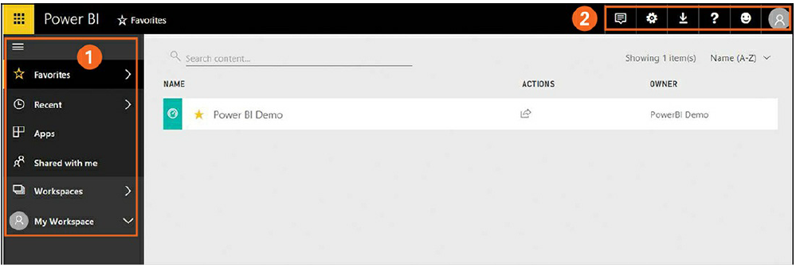

# Power BI service

## GROUP 1
### Favorites 
Click this option to access reports you’ve marked as favorites.
(You’ll learn how to mark a report as a favorite later.)
### Recent 
Click this option to access reports you’ve opened most recently,
in reverse-chronological order.
### Apps 
Click this option to access the entire collection of reports and
dashboards.
### Shared with Me 
To access reports that other users have shared with
you, click this option.
### Workspaces 
To access workspaces to which you have access, such as a
group workspace or a workspace someone else has shared with you,
click this option. (You’ll learn more about Power BI service workspaces
later in this chapter.)
### My Workspace 
Click this to access your own Power BI workspace,
from which you can view your dashboards and create and publish your
own reports. (Note that the precise name of this option differs depending
on what workspaces you have available to you.)

## GROUP 2
### Notification 
Click this icon to view notifications—for example, when
one of your reports is updated, when someone shares a report with you,
and so on. (If you use the Pro version, you will also receive regular
notifications about the number of days remaining on your subscription.)
### Settings 
Click this icon to view statistics on personal storage used, to
manage gateways for connecting on-premises reports to Power BI
dashboards, create and view content packs, and more.
### Download 
Click this icon to download and save reports available across
the Power BI platform.
### Help and Support 
Click this icon to access various help and support
resources online, including a help library and user community. (Note
that there is a separate help and support section for Power BI
developers.)
### Community 
Feedback Click this icon to submit ideas to improve the
overall Power BI experience or to report issues.

