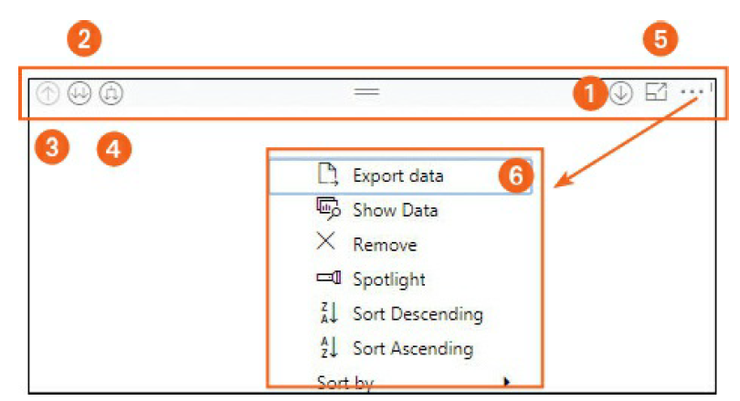

# Power BI visuals out of the box

Power BI Desktop offers OOTB visuals, with updated and
new visuals released by Microsoft on a regular basis. These OOTB visuals
include the following:
- Bar charts
- Column charts
- Line charts
- Area charts
- Line and stacked column charts
- Ribbon charts
- Waterfall charts
- Scatter charts
- Bubble charts
- Pie charts
- Donut charts
- Funnel charts
- Gauge charts
- Cards
- Multi-row card
- KPI visuals
- Tables
- Matrix visuals
- Maps
- ArcGIS maps

## Drill through Power BI visuals

1. Drill Down
2. Expand to Next Level
3. Drill Up
4. Expand Down
5. More options
A More Options menu (marked by an ellipsis) appears. It offers
you access to additional tools for working with visuals in
Power BI. The options are as follows:
- Export Data 
Choose this to convert data in the
selected visual into an Excel file in .CSV format.
- See Data 
Select this to see a tabular representation of
data in the selected visual.
- Remove 
Choose this to delete the selected visual
from the report page.
- Spotlight 
Select this to highlight a specific visual in a
Power BI report.
- Sort 
Choose this to sort the data in the selected visual
in ascending or descending order.

## Apply filters in Power BI reports

- Visual-level filter  
Suppose you have a bar chart, a pie chart, and a table
in your report, and you want to filter the data only in the bar chart. In
that case, you’d apply a visual-level filter to that chart.
- Page-level filter  
Maybe your report has 10 pages, but you want to apply
a filter to just one of those pages. In that case you could apply a pagelevel
filter.
- Report-level filter  
To apply a filter to your entire report, you use a report-level filter.
- Drill-through filter  
This filter enables you to drill through the data in a
report much as you would data in a visual. For example, suppose your
report contains a table. You could apply the drill-through filter to that
table to analyze a piece of data in that table in depth.